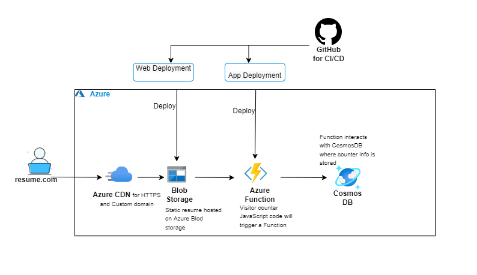

# Azure-Resume-Challenge
I recently built my own resume website as part of a project called The Cloud Resume challenge. It was quite the experience and I learned many new useful tools for provisioning cloud infrastructure through Azure.

You can visit my resume [here](https://www.mariangelateran.com) 

# Azure Technologies being used
•	Azure CosmosDB

•	Azure Functions

•	Azure Storage

•	Azure CDN

# Application Architecture 

